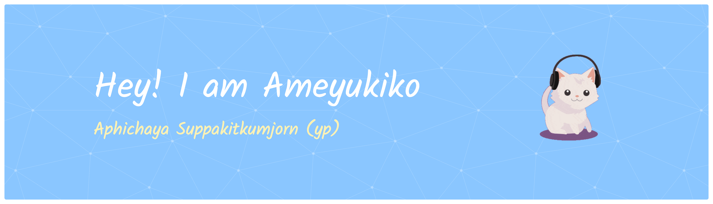

  

 

### 💻 Software Engineering Student | 🎨 UX/UI Designer | 🚀 Full-Stack Developer

Passionate about building modern, responsive, and user-centered web applications. 
I love transforming ideas into beautiful digital experiences through clean code,
creative design, and intuitive user experiences.

 

# 👩‍💻 About Me

- 🎓 Software Engineering Student 
- 🎨 Passionate about **UX/UI Design** & **Product Design**
- 💻 Interested in **Frontend** & **Full-Stack Web Development**
- 🌱 Currently learning **Cloud Computing, System Design & Modern Web Technologies**
- ✨ Love creating clean, responsive, and user-friendly applications
- 📫 **Email:** **y.eepun@hotmail.com**

# 🌐 Connect with Me

# 🚀 Tech Stack

### 💻 Frontend

### ⚙️ Backend

### 🗄️ Database

### 🎨 UI / UX & Design

### ☁️ Cloud, DevOps & Tools

# 📊 GitHub Stats

# 💡 Quote

> *"Design is intelligence made visible. Code is creativity brought to life."*

